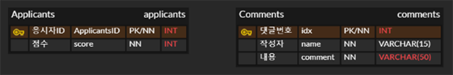
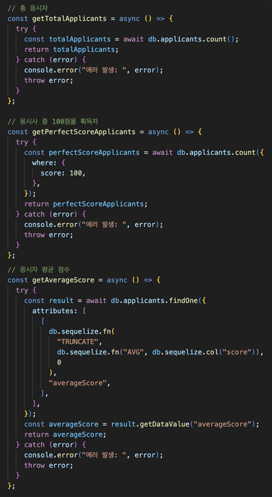

## 팀 명: SEMICOLON

## 1차 프로젝트: 제1회 IT 능력고사

### 기획

MBTI, 성향 테스트, 트렌드 능력고사 같은 사이트를 레퍼런스로 참고했습니다.  
기존 테스트들이 html에 답이 노출되는데, 답을 감추고 서버에서 채점하고 결과를 보여주고자 MVC 패턴으로 기획했습니다.  
부트캠프의 첫 프로젝트인 만큼 지금까지 배운 내용과 기술들을 실습을 통해 복습하며 완전히 이해하는데 의의를 뒀습니다.

### 프로젝트 진행 기간

> 23.11.09 ~ 23.11.23

### Stack

<div align="left">
	
	
	
	
	<br>
	
	
	
	
</div>

### Tools

<div align=left>
	
	
	
</div>

---

## 📺 레이아웃

|                                                                  Main page                                                                  |                                                                  Quiz page                                                                   |                                                                 Result page                                                                 |
| :-----------------------------------------------------------------------------------------------------------------------------------------: | :------------------------------------------------------------------------------------------------------------------------------------------: | :-----------------------------------------------------------------------------------------------------------------------------------------: |
|  |  |  |

---

### 폴더 구조

```bash
├── README.md
├── app.js
├── package-lock.json
├── package.json
├── controller :
│   ├── Capplicants.js : 응시자ID, 응시자 score 계산, 응시자/평균점수/만점자 계산
│   ├── Ccomments.js : 만점자 댓글 달기 기능, 댓글 조회
├── model :
│   ├── index.js
│   ├── applicants.js :응시자ID, 점수 데이터베이스 모델
│   └── comments.js :만점자 댓글 데이터베이스 모델
├── public :
│   ├── CSS
│   ├── img
│   └── JS
│   	└── sharesns.js : SNS 공유하기 기능
├── routes :
│   └── index.js
├── utils :
│   ├── resultValue.js : 점수에 따른 결과페이지 이미지 반환
│   └── answersolution.js : 문항별 정답 배열 저장
└── views :
    ├── index.ejs
    ├── result.ejs
    └── test2023.ejs
```

### Data Base


응시자 정보와 만점자만 남길 수 있는 코멘트 정보를 저장할 수 있도록 2개의 테이블을 만들었습니다.

## 프로젝트 디테일

### 시작 화면

|                                                            테스트 영상                                                            |             코드             |
| :-------------------------------------------------------------------------------------------------------------------------------: | :--------------------------: |
|                                                                         |  |
| 메인 화면에 들어오면 DB에서 응시자와 점수 데이터를 조회해 시퀄라이즈로 총 유저 수, 평균 점수, 만점자 수를 메인 화면에 보여줍니다. |

---

### 테스트 화면

|                                                            테스트 영상                                                            |             코드             |
| :-------------------------------------------------------------------------------------------------------------------------------: | :--------------------------: |
|                                                                      |  |
| 메인 화면에 들어오면 DB에서 응시자와 점수 데이터를 조회해 시퀄라이즈로 총 유저 수, 평균 점수, 만점자 수를 메인 화면에 보여줍니다. |

### 결과 화면

|                               테스트 영상                               |             코드             |
| :---------------------------------------------------------------------: | :--------------------------: |
|       |  |
| 유저가 만점자면 결과 화면에 코멘트를 달 수 있는 모달 팝업을 보여줍니다. |

---

## Infomation

- 이세윤(FE) - dominobomb@gmail.com
- 이산하(FE) - sanppi@naver.com
- 한기선(FE) - mssk2490@gmail.com
- 권구호(BE) - kguho9202@gmail.com
- 이다현(BE) - da0956@gmail.com

<!-- Markdown link & img dfn's -->

[npm-image]: https://img.shields.io/npm/v/datadog-metrics.svg?style=flat-square
[npm-url]: https://npmjs.org/package/datadog-metrics
[npm-downloads]: https://img.shields.io/npm/dm/datadog-metrics.svg?style=flat-square
[travis-image]: https://img.shields.io/travis/dbader/node-datadog-metrics/master.svg?style=flat-square
[travis-url]: https://travis-ci.org/dbader/node-datadog-metrics
[wiki]: https://github.com/yourname/yourproject/wiki
